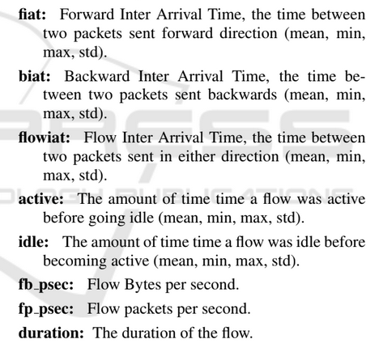

# CIC_DDoS 2019

Here we house the dataset and all of the data analysis code for the paper. Experiments are held in the experiments folder. 

Our prepared datasets are generated from the original [CIC_DDoS dataset](https://www.unb.ca/cic/datasets/ddos-2019.html). To reproduce the datasets used in these experiments, download the dataset from the link above and place it in the original folder, then open the dataset_generation.ipynb notebook and click run all.

We removed 18 features to generate the baseline datasets. 9 of the eliminated features contained only 0 values as indicated by [this paper](https://www.researchgate.net/publication/346512047_Tensor_based_framework_for_Distributed_Denial_of_Service_attack_detection) and verified by us in dataset_statistics.ipynb. The remaining features are either duplicates, unlabeled features we cannot correlate with anything real, IP addresses, port addresses, or are string types that will not be useable for machine learning without some encoding scheme.

We generate the timebased datasets based on the 23 time-based features used in [this paper](https://www.researchgate.net/publication/314521450_Characterization_of_Tor_Traffic_using_Time_based_Features). The time-based features used are given by the following pic:

Besides the 23 features used by Lashkari et al., the dataset contains two more time-based features:
* Forward Inter-Arrival Time Total (Fwd IAT Total)
* Backward Inter-Arrival Time Total (Bwd IAT Total)