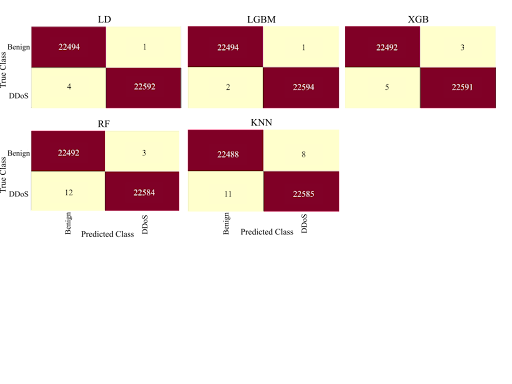

Confusion Matrices for Scenario A control experiment

 

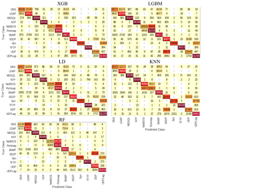

Confusion Matrices for Scenario B control experimentation

 

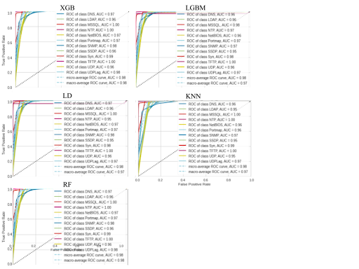

ROC Curves for Scenario B control experimentation

 

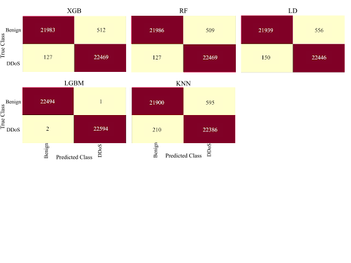

Confusion Matrices for Scenario A time-based experimentation

 

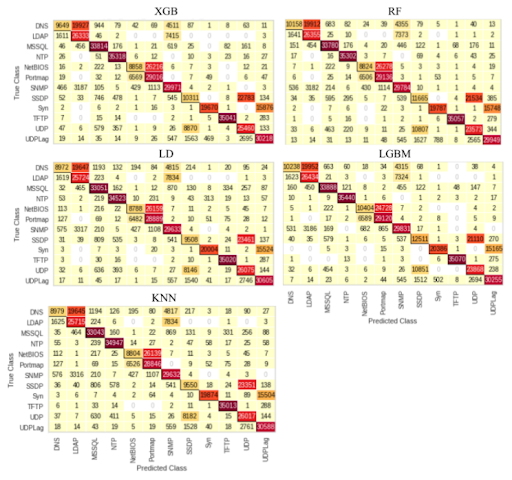

Confusion Matrices for Scenario B time-based experimentation

 

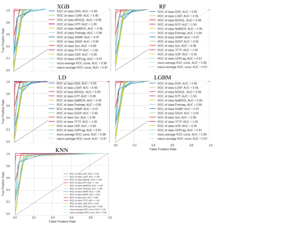

ROC Curves for Scenario B time-based experimentation

 

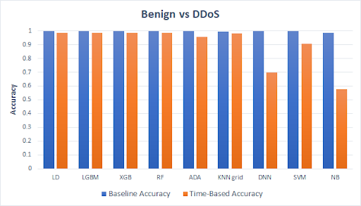

Displays the accuracies for each model in Scenario A when trained on control and time-based features

 

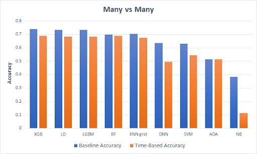

Displays the accuracies for each model in Scenario B when trained on control and time-based features

 

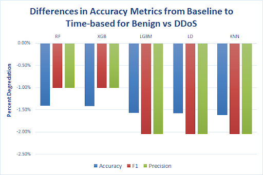

The percent decrease in accuracy, F1-score, and precision for models in Scenario A when trained on time-based features

 

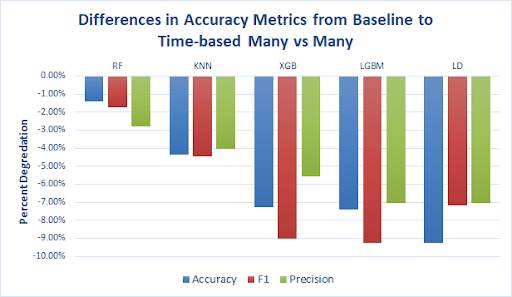

The percent decrease in accuracy, F1-score, and precision for models in Scenario B when trained on time-based features

 

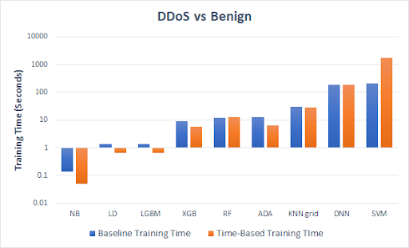

Training time in seconds for each model in Scenario A when trained on control and time-based features. Values represented on a logarithmic scale

 

Training time in seconds for each model in Scenario B when trained on control and time-based features.Values represented on a logarithmic scale

 

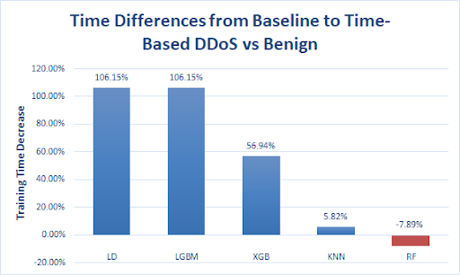

Indicates the percent decrease in training time for models in Scenario A when trained on time-based features

 

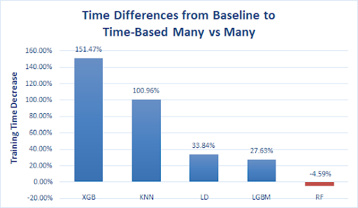

 Indicates the percent decrease in training time for models in Scenario B when trained on time-based features

 